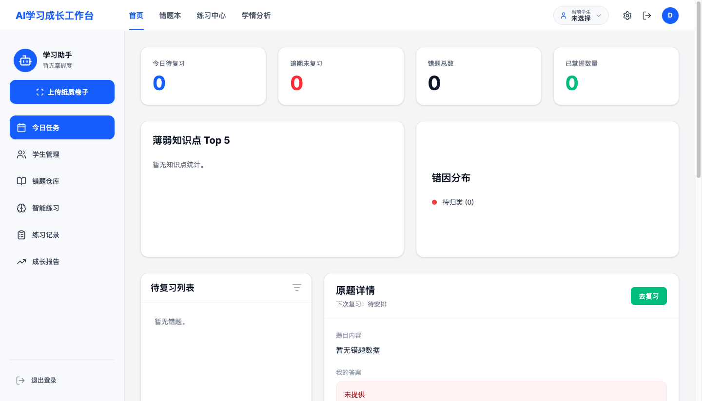
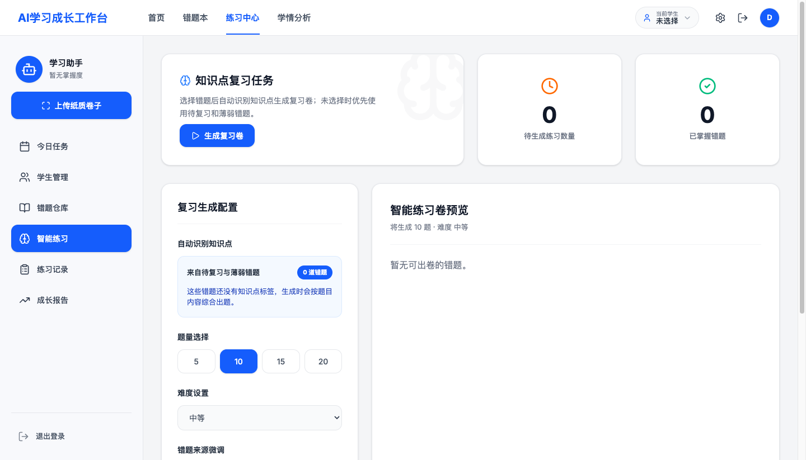
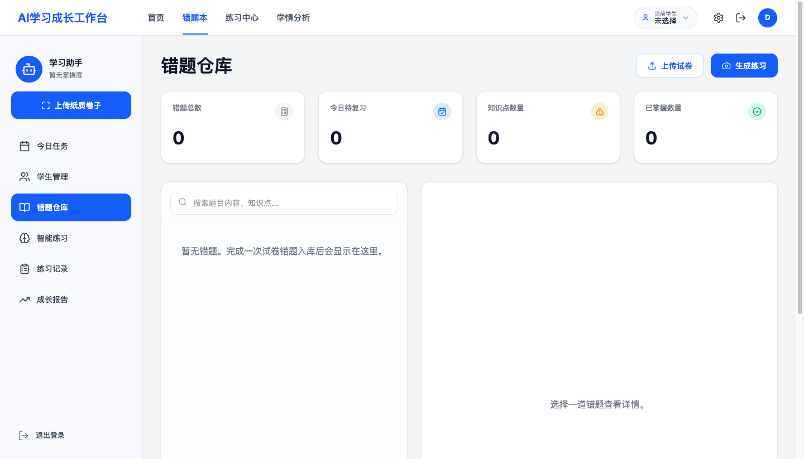
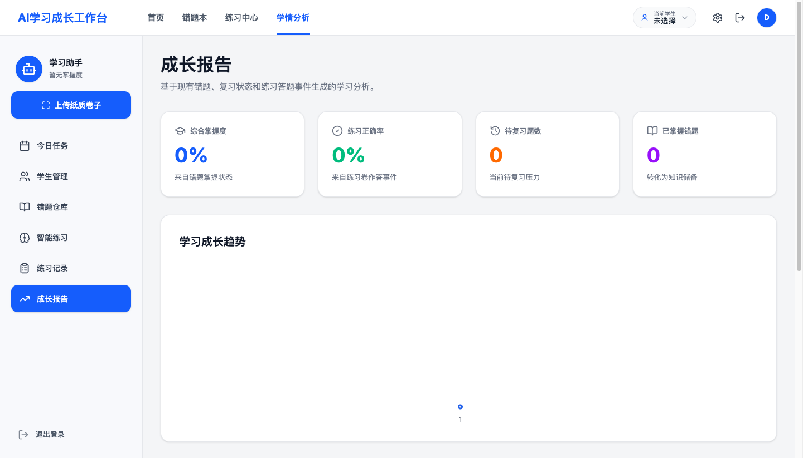

# AI Edu Workflow Tools

> Self-hostable AI workflows for everyday learning tasks — essay grading,
> mistake (error) analysis, and slide/report outlining — with photo upload
> support so students can simply snap a picture of their homework.

AI Edu Workflow Tools turns a handful of high-frequency study tasks into
reusable, self-hostable workflows. Instead of being a generic "chat with AI"
box, each tool is purpose-built around a real classroom or home-study task and
returns structured, ready-to-use output.

English | [简体中文说明见文末](#中文简介)

## Screenshots

| Dashboard | Smart practice |
| --- | --- |
|  |  |

| Mistake bank | Growth report |
| --- | --- |
|  |  |

> The UI is currently in Chinese; internationalization is on the roadmap.

## Features

- **Essay grading** — paste or upload an essay and get structured feedback
  (scoring, strengths, issues, rewrite suggestions).
- **Mistake / error analysis** — submit a wrong answer (text or photo) and get
  an explanation, knowledge-point tagging, and an auto-built mistake bank with
  spaced-review scheduling.
- **Outline generation** — turn a topic into a slide deck / report outline.
- **Photo upload** — accepts JPG / PNG / WebP so students can submit photos of
  questions, essays, or screenshots; images are read by a vision model.
- **Practice paper export** — generate a consolidation worksheet from the
  mistake bank as a downloadable PDF (`pdfkit`).
- **Email verification-code login** — passwordless login; first successful
  verification auto-registers the account.
- **Zero-setup storage** — works out of the box writing to local JSONL files;
  optionally switch to MySQL for production.
- **Model-agnostic** — talks to any OpenAI-compatible Chat Completions API
  (OpenAI, DeepSeek, or your own gateway).

## Tech stack

- **Backend:** Node.js (Express-style server in `server.js`), OpenAI-compatible
  model calls, optional MySQL (`mysql2`), PDF via `pdfkit`, email via
  `nodemailer`.
- **Frontend:** React 19 + Vite 6 + Tailwind CSS 4 (`src/`). A legacy static
  prototype (`index.html` / `app.js` / `styles.css`) is also served as a
  fallback.

## Quick start

```bash
# 1. Install dependencies
npm install

# 2. Configure environment
cp .env.example .env
#    then edit .env and set AI_API_KEY (and optionally MySQL / SMTP)

# 3. Build the frontend and start the server
npm run build
npm start
```

Then open <http://localhost:4173>.

With no `AI_API_KEY` set, text tools fall back to local templates so you can
explore the UI without any external API. Photo recognition requires a vision
model key.

### Development

Run the API server and the Vite dev server in two terminals:

```bash
npm start            # API + static server on PORT (default 4173)
npm run dev          # Vite dev server with HMR on port 3000
```

`npm run check` runs `tsc --noEmit` plus a `node --check` on the server.

## Configuration

All configuration is via environment variables — see [`.env.example`](.env.example)
for the full list. Highlights:

| Variable | Purpose | Default |
| --- | --- | --- |
| `AI_API_KEY` | API key for the OpenAI-compatible model | — |
| `AI_ENDPOINT` | Base URL of the model endpoint | `https://api.openai.com/v1` |
| `AI_MODEL` / `AI_VISION_MODEL` | Text / vision model names | `gpt-4o-mini` |
| `MYSQL_ENABLED` | Use MySQL instead of local JSONL | `false` |
| `SMTP_*` | SMTP for email login codes | — |
| `AUTH_EXPOSE_DEV_CODE` | Return login code in API response (dev only) | `true` |

`OPENAI_API_KEY` / `OPENAI_MODEL` / `OPENAI_BASE_URL` are honoured as fallbacks.
You can also switch text generation to DeepSeek via `AI_PROVIDER=deepseek` and
the `DEEPSEEK_*` variables.

### Storage

Without `MYSQL_PASSWORD`, the app persists to `data/*.jsonl` — no database
required. To use MySQL 8.0, set `MYSQL_ENABLED=true` and the `MYSQL_*` variables.
Tables use the `edu_` prefix:

```
edu_users  edu_children  edu_login_codes  edu_generations
edu_mistake_records  edu_exam_papers  edu_mastery_events
```

## API overview

The server exposes a `/api/v1` JSON API so web, app, and mini-program clients
can share the same backend:

| Method & path | Description |
| --- | --- |
| `GET /api/v1/tools` | Tool config and remaining quota |
| `POST /api/v1/uploads` | Upload an image, returns `fileId` |
| `POST /api/v1/generations` | Run a tool with form input and optional `fileId` |
| `GET /api/v1/generations` | Recent generation records |
| `GET /api/v1/mistakes` | Query the mistake bank (subject, grade, status, …) |
| `GET /api/v1/mistakes/due` | Mistakes due for review |
| `PATCH /api/v1/mistakes/:id` | Edit knowledge point, reason, mastery status |
| `POST /api/v1/mistakes/:id/reviews` | Record a review and reschedule |
| `POST /api/v1/exam-papers` | Build a practice paper, returns a PDF `pdfUrl` |
| `GET /api/v1/mastery-stats` | Knowledge-point mastery statistics |

When a `mistake` generation completes, a mistake record is created
automatically and returned as `mistakeId`.

For Linux PDF export with CJK text, install a CJK font and set:

```bash
PDF_FONT_PATH=/usr/share/fonts/opentype/noto/NotoSansCJK-Regular.ttc
PDF_FONT_NAME=NotoSansCJKsc-Regular
```

## Project layout

```
server.js            Backend API, model calls, storage, PDF export
src/                 React + Vite frontend (pages, components, lib)
app.js, index.html   Legacy static prototype (served as fallback)
visualTemplates.js   Output rendering templates
docs/                Feature briefs and deployment guide
```

## Contributing

Contributions are welcome — see [CONTRIBUTING.md](CONTRIBUTING.md). Please open
an issue to discuss substantial changes first.

## License

[MIT](LICENSE)

---

## 中文简介

面向学生、家长和老师的 AI 教学工作流工具，可自部署。把作文批改、错题解析、
PPT/报告大纲生成等高频学习任务做成结构化、可复用的工作流，支持拍照上传题目与作文。

- 后端 Node.js（`server.js`），调用任意 OpenAI 兼容模型接口
- 前端 React 19 + Vite + Tailwind（`src/`）
- 默认写入本地 `data/*.jsonl`，零数据库即可运行；可切换 MySQL
- 邮箱验证码登录，错题本支持间隔复习与练习卷 PDF 导出

快速开始：`npm install` → 复制 `.env.example` 为 `.env` 并填入 `AI_API_KEY`
→ `npm run build && npm start`，访问 <http://localhost:4173>。
